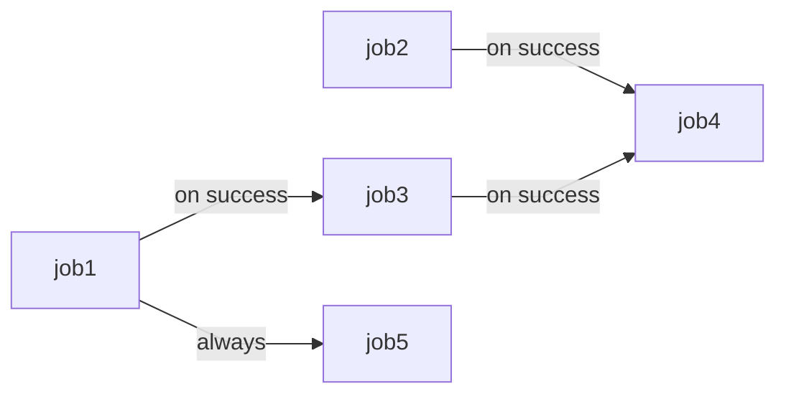

# Awesome GitHub Actions

This repository serves as a comprehensive collection of GitHub Actions workflows examples. 
It provides a variety of workflow configurations that demonstrate different use cases and 
best practices for automating CI/CD processes using GitHub Actions. Each 
example includes a name for the workflow, a list of trigger events, and a set of jobs. Each 
job contains a list of steps that execute in order when the job runs. These steps may access
 environment variables, conditions, expressions, and secrets to perform various actions, 
 such as checking out the source repository, running scripts, and setting up a `tmate` session
 for debugging purposes. Examples cover different areas of functionality, such as job 
 matrix, parallel jobs, job ordering, context variables, expression evaluation, outputting 
 variables, and event triggers.

## GitHub Actions
GitHub Actions is CI/CD platform for automatic build, test, and deployment. GitHub Actions allows you to run workflows when a `push`, `pull request`, or other `event` happens in your repository. You can use virtual machines provided by GitHub or manage your own runners in your own infrastructure.
Workflow is a process that runs one or more jobs. They can be run either in parallel or in sequential order. 
Workflow basics:
- One or more `events` that will trigger the workflow. `Event` is a specific activity in a repository.
- One or more `jobs`, each of which will execute on a `runner` machine and run a series of one or more `steps`. By default, every job is independent
- Each `step` can either run a script that you define or run an `action`, which is a reusable extension that can simplify your workflow
- Each `Runner` is a newly-provisioned virtual machine. GitHub provides Ubuntu Linux, MS Windows, and macOS runners. You can host your own runner as well. Every runner executes a single job. 
  
Workflow files are `yaml` files and are placed in the `.github/workflows` directory in your repository on GitHub. 

## Examples 
 **Note** **_By default, all workflows will be executed on `ubuntu-latest ` image unless otherwise specified_**

## Example 01: Hello world! 

*_Get familiar with basic workflow syntax_*

This example workflow prints `current path`, `Hello world`, followed by `Step 1…`, `Step 2…`, `Step 3…`, and finally `Goodbye`.

   **Elements of current workflow:**
1. Name of workflow (optional element)
   ```yaml
   name: hello-world-example
   ```
2. The `on` section defines what event triggers the workflow. Events that will trigger a workflow. Here, the trigger event is `push`. 
The optional parameter `paths` allows configuring a workflow to run based on what file paths are changed.

   ```yaml
    on:
      push:
        paths:
          - '.github/workflows/01-hello-world.yml'
   ```
3. Job. The job name is `say-hello`.
The keyword `runs-on` configures the job to run on the latest version of an Ubuntu Linux runner.
   ```yaml
    jobs:
      say-hello:
        runs-on: ubuntu-latest
   ```

4. `Steps` are a list of commands to run. The `uses` keyword specifies the action used in this job: `actions/checkout` version`v2`. 
   This is an action that checks out your repository onto the runner. 
   You should use the `checkout action` any time your workflow will run against the repository's code.
   Next step sets option `working-directory` to the indicated path and prints current path.
   ```yaml
            steps:
              - uses: actions/checkout@v2
       
              - name: Print current path
                working-directory: ./01-hello-world
                run: pwd
   ```
5. Pipe `|` is used to start multiple strings in a `yaml` file
   ```yaml      
      - name: Do stuff
        run: |
          echo "Step 1..."
          echo "Step 2..."
          echo "Step 3..."
          echo "Step 4..."
   ```

## Example 02: Event triggers 

*_This example demonstrates how to trigger workflow on different events_*

The `on` section defines what event triggers the workflow. List of events you can see [here](https://docs.github.com/en/actions/using-workflows/events-that-trigger-workflows). 
Optionally you may include/exclude `branches`, `tags`, or `paths` that trigger workflow by indicating their name or pattern to match. 
You may define multiple events and options for them to customize your workflow run. Also, it is possible to set a schedule to run your workflow,
specified with [POSIX cron syntax](https://crontab.guru/).

  ```yaml
  on: 
    push:
       branches: 
         - '02-develop'
         - '02-foo/*'
         - '02-foo/**'
         - '!02-foo/*/456' #except
       tags:
         - '*'
       paths:
         - '.github/workflows/02-event-triggers.yml'
    pull_request:
      branches:
        - '02-develop'
      paths:
        - '.github/workflows/02-event-triggers.yml'
    schedule:
      - cron: '*/15 * * * *'
   ```
Step prints trigger event name:
   ```yaml
         - name: Event
           run: echo "Triggered by $GITHUB_EVENT_NAME"
   ```

## Example 03: Actions

*_This example demonstrates the usage of different actions type in one workflow_*

Actions reduce number of steps by providing reusable `code` for common tasks, such as checkout to gitHub repository or installing node. 
To run an action include keyword `uses` pointing to a GitHub repo with the pattern `{owner}/{repo}@{ref}` or `{owner}/{repo}/{path}@{ref}`. A `ref` can be a branch, tag or SHA. Some actions have required or optional parameters.
GitHub officially supports many common [actions](https://github.com/actions).

Example of usage of the different actions in workflow:
   ```yaml
    steps:
      - uses: actions/checkout@v2
      - uses: actions/setup-node@v1
        with:
          node-version: '15.8.0'
   ```

In these steps : 
- [actions/checkout](https://github.com/actions/checkout) for checking out your repo into the working directory at the ref that triggered workflow (e.g., branch push) 
- [actions/setup-node](https://github.com/actions/setup-node) sets up your workflow with a specific node version, and makes node and npm available in the following steps.

## Example 04: Environment variables

*_Using environment variables in different contexts_* 

Environment variables can be:
* default. Find the list of default variables [here](https://docs.github.com/en/actions/learn-github-actions/variables#default-environment-variables) and defined by the user.
* or custom for:
  * **a single workflow**. To create a variable for a single workflow use the `env` key within the workflow file. The scope of the variables can be: the entire workflow, job, or a specific step. The variable's scope is limited to the element in which it is defined.
  * **multiple workflows**. Variables and secrets can be created at different levels: [organization](https://docs.github.com/en/actions/learn-github-actions/variables#creating-configuration-variables-for-an-organization), [repository](https://docs.github.com/en/actions/learn-github-actions/variables#creating-configuration-variables-for-a-repository) and [environment](https://docs.github.com/en/actions/learn-github-actions/variables#creating-configuration-variables-for-an-environment) levels.

To define environment variable in a workflow you can use keyword `env` at different levels.
Job:
```yaml
jobs:
  use-env-vars:
    runs-on: ubuntu-latest
    env:
      VIDI: 'I saw'
```
Step:
```yaml
    steps:
   ...
      - name: Show me the vars
        run: echo "$VENI, $VIDI, $VICI"
        env:
          VICI: 'I conquered'
```
Also, you can set new environment variables by adding it to GITHUB_ENV. The variable will be available in next steps.
```yaml
      - name: Create env var
        run: echo "foo=bar" >> $GITHUB_ENV
```
To get values of the environment variables:
```yaml
      - name: Useful default vars
        run: |
          echo "Workflow name:  $GITHUB_WORKFLOW"
          echo "Workspace:      $GITHUB_WORKSPACE"
          echo "Event:          $GITHUB_EVENT_NAME"
          echo "SHA:            $GITHUB_SHA"
          echo "Ref:            $GITHUB_REF"
```
Get list of all environment variables:
```yaml
      - name: Show env variables list
        run: env
```

## Example 05: Parallel jobs

_*Running jobs in parallel*_

Multiple jobs are running in parallel by default and have a particular runner:
```yaml
jobs:
  job-a:
    runs-on: ubuntu-latest
    steps:
      - run: echo "Doing work"
  job-b:
    runs-on: ubuntu-latest
    steps:
      - uses: actions/checkout@v2
```

## Example 06: Job ordering

_*By default, all jobs are running in parallel. To force job ordering use the `needs` keyword*_

It is possible to wait one or more jobs:
```yaml
  job3:
    runs-on: ubuntu-latest
    needs: job1
    steps:
      - run: echo "job1 done, running job3"
  job4:
    runs-on: ubuntu-latest
    needs: [job2, job3]
    steps:
      - run: echo "job2 & job3 done, running job4"
```
`job5` will run even if `job1` will fail
```yaml
  job5:
    runs-on: ubuntu-latest
    if: ${{ always() }}
    needs: job1
    steps:
      - run: echo "job1 completed with status ${{ needs.job1.result }}, running job5
```
The diagram of the job running sequence is provided


## Example 07: Job matrix 

_*You can run multiple jobs with different configurations by using a job matrix. Jobs defined by matrix run in parallel by default*_ 

The `matrix` keyword is how you define a job matrix. Each user-defined key is a matrix parameter. Here we’ve defined two parameters: `os`, for
runner's OS, and `node`, to indicate node version. Each value of the parameters from the list are used in a `cartesian product` to create jobs. 
This section defines a 2 x 3 matrix of 6 jobs, each with a different combination of `os` and `node`. The `exclude` keyword prevents jobs with
specific configurations from running. The `include` allows you to add new jobs to the matrix. Note that the `include` rules always 
evaluated after the `exclude` rules.
```yaml
  my-job:
    strategy:
      matrix:
        os: [ubuntu-18.04, ubuntu-22.04]
        node: [12, 14, 16]
        exclude:
        - os: ubuntu-18.04
          node: 12
```

## Example 07a: [Self-hosted runners for multiple jobs](./README_SELFHOSTED_RUNNERS.md)

A `runner` is a server that runs your workflows when they're triggered. Each runner can run a single job at a time. GitHub provides Ubuntu Linux, Microsoft Windows, and macOS runners to run your workflows; each workflow run executes in a fresh, newly-provisioned virtual machine. If you need a different operating system or require a specific hardware configuration, you can host your [own runners](https://docs.github.com/en/actions/hosting-your-own-runners/managing-self-hosted-runners/about-self-hosted-runners).
A self-hosted runner is a system that you deploy and manage to execute jobs from GitHub Actions on GitHub.com.

## Example 08: Outputs

Output data can be shared between `jobs` and `steps`.
Create outputs for a step by writing to stdout in the format of <name>=<value>:

   ```yaml
      - name: Do Work
        run: |
          echo "FAV_NUMBER=3" >> $GITHUB_OUTPUT
          echo "FAV_COLOR=blue" >> $GITHUB_OUTPUT
        id: abc
   ```
A step can have multiple outputs. Steps that create outputs must have unique `id`.
Use the steps context variable and step `id` to get the value `${{steps.<step_id>.outputs.<step_output_name>}}`:
```yaml
      - name: Read output
        run: |
          echo "${{steps.abc.outputs.FAV_NUMBER}}"
          echo "${{steps.abc.outputs.FAV_COLOR}}"
```
Create outputs for a job which will be available to other jobs that needs it (see Job Ordering).
You can include output from steps that ran for the job.
```yaml
    job1:
    outputs:
      fav-animal: tiger
      fav-number: ${{steps.abc.outputs.FAV_NUMBER}}
```
Use context expressions to grab outputs from a job included in needs
`needs: <job_name>`, to address output `${{needs.<job_name>.outputs.<job_output_name>}}`:
  ```yaml
     job2:
       runs-on: ubuntu-latest
       needs: job1
       steps:
         - run: |
            echo "${{needs.job1.outputs.fav-animal}}"
            echo "${{needs.job1.outputs.fav-number}}"
   ```

## Example 09: Context

_*`Contexts` are a way to access information about workflow runs, variables, runner environments, jobs, and steps. Each context is an object that contains properties, which can be strings or other objects. Contexts variables are accessible outside the run commands.*_

Using values of the `matrix` context:
```yaml
        env:
          GREETING: ${{ matrix.greeting }}
```
Accessing value of the secret `USERNAME` defined in the GitHub:
```yaml
        env:
          A_SECRET: ${{ secrets.USERNAME }}
```
Using event name in expression:
```yaml
        if: ${{ github.event_name == 'pull_request' }}
```

## Example 10: Expressions

_*Workflows support evaluating expressions,comparisons and simple functions.*_

String comparison:
```yaml
      - name: Print if 'Hello'
        if: ${{ matrix.greeting == 'Hello' }}
        run: echo "greeting is Hello"
      - name: Print if starts with 'He'
        if: ${{ startsWith(matrix.greeting, 'He') }}
        run: echo "greeting starts with He"
      - name: Print if ends with 'y'
        if: ${{ endsWith(matrix.greeting, 'y') }}
        run: echo "greeting ends with y"
      - name: Print if contains 'ow'
        if: ${{ contains(matrix.greeting, 'ow') }}
        run: echo "greeting contains ow"
```
Formatting:
```yaml
      - name: Print formatted greeting
        run: |
          echo "${{ format('{0} says {1}', github.actor, matrix.greeting) }}"
```
Working with `JSON`:
```yaml
      - name: To JSON
        run: echo 'Job context is ${{ toJSON(job) }}'
      - name: From JSON
        env: ${{ fromJSON('{"FAVORITE_FRUIT":"APPLE", "FAVORITE_COLOR":"BLUE"}') }}
        run: echo "I would like a ${FAVORITE_COLOR} ${FAVORITE_FRUIT}"
```
Running basing on previous results:
```yaml
      - name: Success
        if: ${{ success() }}
        run: echo "Still running..."
      - name: Always
        if: ${{ always() }}
        run: echo "You will always see this"
      - name: Cancelled
        if: ${{ cancelled() }}
        run: echo "You canceled the workflow"
      - name: Failure
        if: ${{ failure() }}
        run: echo "Something went wrong..."
```

## Example 11: `Tmate` terminal

_*The `Tmate` session will be started after fail on the previous step. Use this failing workflow for training*_

The workflow will fail on the following step because no `npm` is installed and no node actions is used in this workflow. 

```yaml
      - name: Run tests
        working-directory: ./11-tmate
        run: npm test
```
Open `tmate` session using http link from your workflow logs. 
If `tmate` is [installed](./README_SELFHOSTED_RUNNERS.md#7-debugging-running-workflow) on your machine your may also connect to the session throw terminal. Command is provided in your logs as well.


Run npm install:

```shell
   npm ci
```

and check if tests will pass:

```shell
   npm test
```

continue workflow run by creating file:

```shell
touch /continue
```

## Nektos Act
### Install Nektos Act on Ubuntu Jammy

```shell
sudo apt install act
```
To install `Nektos Act` on other OS follow the instructions from [section](https://github.com/nektos/act#installation-through-package-managers)

To run the following commands you should clone a GitHub project with existing GitHub Actions workflows and go to its directory. You can use the current project, too.

1. View all jobs that are triggered by pull_request event
```shell
act -l
```
2. View all jobs triggered by events, e.g. by `pull_request`
```shell
act <event-name> -l
act pull_request -l
```
or in the certain workflow file, e.g. in `main.yaml`
```shell
act <file-name> -l
act main.yaml -l
```
3. Run job with a specific name:
```shell
act -j <job-name> 
```
4. Your may also explicitly indicate the workflow and job to run using flags `--workflow`and `--job`, respectively, flag `--verbosity` enables additional logging.
```shell
act --workflows .github/workflows/main.yml --verbose --job my-job
```
5. Use alternative environment to run your workflows. `runner-image-name` - should be same as in the workflow `yaml` file
```shell
act -P <runner-image-name>=<image-to-be-used>
act -P ubuntu-latest=catthehacker/ubuntu:act-20.04
```

## [Ignite migration tool](https://github.com/Alliedium/ignite-migration-tool)

1. [About project](https://github.com/Alliedium/ignite-migration-tool/blob/main/README.md)
2. [Apache Ignite Migration Tool CI/CD](https://github.com/Alliedium/ignite-migration-tool/blob/main/README_CI.md)
3. [Apache Ignite Migration Tool CI/CD GPG](https://github.com/Alliedium/ignite-migration-tool/blob/main/README_GPG.md)


## References
#### GitHub Actions
1. [GitHub Actions workflows](https://docs.github.com/en/actions/using-workflows/about-workflows)
2. [GitHub Actions workflows basics, examples and a quick tutorial](https://codefresh.io/learn/github-actions/github-actions-workflows-basics-examples-and-a-quick-tutorial/)
3. [Trigger a workflow](https://docs.github.com/en/actions/using-workflows/triggering-a-workflow)
4. [Job environments](https://docs.github.com/en/actions/using-jobs/using-environments-for-jobs)
5. [Expressions in GitHub Actions](https://docs.github.com/en/actions/learn-github-actions/expressions)
6. [GitHub Actions contexts](https://docs.github.com/en/actions/learn-github-actions/contexts)
7. [GitHub Actions variables](https://docs.github.com/en/actions/learn-github-actions/variables)
8. [GitHub Actions common actions](https://github.com/actions)
9. [Good security practices for using GitHub Actions features](https://docs.github.com/en/actions/security-guides/security-hardening-for-github-actions)
10. [Encrypted secrets](https://docs.github.com/en/actions/security-guides/encrypted-secrets)
11. [Outputs for jobs](https://docs.github.com/en/actions/using-jobs/defining-outputs-for-jobs)
12. [Output commands](https://github.blog/changelog/2022-10-11-github-actions-deprecating-save-state-and-set-output-commands/)
13. [Tmate actions](https://github.com/mxschmitt/action-tmate)

#### Act
14. [Act](https://github.com/nektos/act)
15. [GitHub Actions on your local machine](https://dev.to/ken_mwaura1/run-github-actions-on-your-local-machine-bdm)
16. [Debug GitHub Actions locally with act](https://everyday.codes/tutorials/debug-github-actions-locally-with-act/)