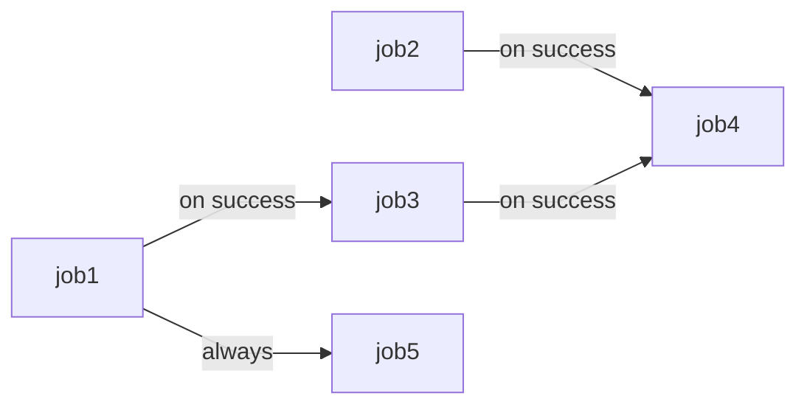

# Awesome GitHub Actions

This repository serves as a comprehensive collection of GitHub Actions workflows examples. 
It provides a variety of workflow configurations that demonstrate different use cases and 
best practices for automating CI/CD processes using GitHub Actions. Each 
example includes a name for the workflow, a list of trigger events, and a set of jobs. Each 
job contains a list of steps that execute in order when the job runs. These steps may access
 environment variables, conditions, expressions, and secrets to perform various actions, 
 such as checking out the source repository, running scripts, and setting up a tmate session
 for debugging purposes. Examples cover different areas of functionality, such as job 
 matrix, parallel jobs, job ordering, context variables, expression evaluation, outputting 
 variables, and event triggers.

## GitHub Actions
GitHub Actions is CI/CD platform for automatic build, test, and deployment. GitHub Actions allows you to run workflows when a `push`, `pull request`, or other `event` happens in your repository. You can use virtual machines provided by GitHub or manage your own runners in your own infrastructure.
Workflow is a process that runs one or more jobs. They can be run either in parallel or in sequential order. 
Workflow basics:
- One or more `events` that will trigger the workflow. `Event` is a specific activity in a repository.
- One or more `jobs`, each of which will execute on a `runner` machine and run a series of one or more `steps`. By default, every job is independent
- Each `step` can either run a script that you define or run an `action`, which is a reusable extension that can simplify your workflow
- Each `Runner` is a newly-provisioned virtual machine. GitHub provides Ubuntu Linux, MS Windows, and macOS runners. You can host your own runner as well. Every runner executes a single job. 
  
Workflow files are `yaml` files and are placed in the `.github/workflows` directory in your repository on GitHub. 

## Examples' Description 
 NB: By default, all workflows will be executed on `ubuntu-latest ` image unless otherwise specified

<details>
<summary> 

### Example 01: Hello world! 

*_Get familiar with basic workflow syntax_*

</summary>
<pre>

This example workflow prints `Hello world`, followed by `Step 1…`, `Step 2…`, `Step 3…`, and finally `Goodbye`.

Name of your workflow (optional)
```
name: hello-world-example
```
The `on` section defines what event triggers the workflow. Events that will trigger a workflow. Here, the trigger event is `push`. 
The optional parameter `paths` allows configuring a workflow to run based on what file paths are changed.

    ```
    on:
      push:
        paths:
          - '.github/workflows/01-hello-world.yml'
    ```
The job name is `say-hello`.
The keyword `runs-on` configures the job to run on the latest version of an Ubuntu Linux runner.
`Steps` are a list of commands to run.
The `uses` keyword specifies that this step will run `v2` of the `actions/checkout` action. 
This is an action that checks out your repository onto the runner. You should use the `checkout action` any time your workflow will run against the repository's code
Option `working-directory` sets the working directory to the indicated path.
 ```
    jobs:
      say-hello:
        runs-on: ubuntu-latest
        steps:
          - uses: actions/checkout@v2
    
          - name: Print current path
            working-directory: ./01-hello-world
            run: pwd
   ```
Pipe `|` is used to start multiple strings in a `yaml` file
   ```      
      - name: Do stuff
        run: |
          echo "Step 1..."
          echo "Step 2..."
          echo "Step 3..."
          echo "Step 4..."
   ```

</pre>
</details>

<details>
<summary>

### Example 02: Event triggers 

*_This example demonstrates how to trigger workflow on different events_*

</summary>
<pre>

The `on` section defines what event triggers the workflow. List of events you can see [here](https://docs.github.com/en/actions/using-workflows/events-that-trigger-workflows). Optionally you may include/exclude `branches`, `tags`, or `paths` that trigger workflow by indicating their name or pattern to match. You may define multiple events and options for them to customize your workflow run. Also, it is possible to set a schedule to run your workflow, specified with [POSIX cron syntax](https://crontab.guru/).

  ```   
  on: 
    push:
       branches: 
         - '02-develop'
         - '02-foo/*'
         - '02-foo/**'
         - '!02-foo/*/456' #except
       tags:
         - '*'
       paths:
         - '.github/workflows/02-event-triggers.yml'
    pull_request:
      branches:
        - '02-develop'
      paths:
        - '.github/workflows/02-event-triggers.yml'
   schedule:
      - cron: '*/15 * * * *'
   ```
Job prints `current path`, message with `GITHUB_EVENT_NAME` that triggered workflow and `Hello world` message

</pre>
</details>

<details>
<summary>

### Example 03: actions

*_This example demonstrates the usage of different actions type in one workflow_*

</summary>
<pre>

Actions reduce number of steps by providing reusable `code` for common tasks, such as checkout to gitHub repository or installing node. 
To run an action include keyword `uses` pointing to a GitHub repo with the pattern `{owner}/{repo}@{ref}` or `{owner}/{repo}/{path}@{ref}`. A `ref` can be a branch, tag or SHA. Some actions have required or optional parameters.
GitHub officially supports many common [actions](https://github.com/actions). 
Example of usage of the different actions in workflow:

   ```    
    steps:
      - uses: actions/checkout@v2
      - uses: actions/setup-node@v1
        with:
          node-version: '15.8.0'
   ```
In these steps : 
- Action for checking out your repo into the working directory at the ref that triggered workflow (e.g., branch push): [actions/checkout](https://github.com/actions/checkout)
- Action sets up your GitHub Actions workflow with a specific node version, and makes node and npm available in the following steps: [actions/setup-node](https://github.com/actions/setup-node)

</pre>
</details>

<details>
<summary> 

### Example 04: Environment variables

*_Using environment variables in different contexts_* 

</summary>
<pre>

Environment variables can be:
- default. Find the list of default variables [here](https://docs.github.com/en/actions/learn-github-actions/variables#default-environment-variables) and defined by the user.
or custom for:
- a single workflow. To create a variable for a single workflow use the `env` key within the workflow file. The scope of the variables can be: the entire workflow, job, or a specific step. The variable's scope is limited to the element in which it is defined. 
- multiple workflows. Variables and secrets can be created at different levels: [organization](https://docs.github.com/en/actions/learn-github-actions/variables#creating-configuration-variables-for-an-organization), [repository](https://docs.github.com/en/actions/learn-github-actions/variables#creating-configuration-variables-for-a-repository) and [environment](https://docs.github.com/en/actions/learn-github-actions/variables#creating-configuration-variables-for-an-environment) levels.

</pre>
</details>

<details>
<summary> 

### Example 05: Parallel jobs

_*Running jobs in parallel*_

</summary>
<pre>
Multiple jobs are running in parallel by default and have a particular runner
</pre>
</details>

<details>
<summary>

### Example 06: Job ordering

</summary>
<pre>

By default, all jobs are running in parallel. To force job ordering use the `needs` keyword
The diagram of the job running sequence is provided: 



</pre>
</details>

<details>
<summary> 

### Example 07: Job matrix 

_*You can run multiple jobs with different configurations by using a job matrix. Jobs defined by matrix run in parallel by default*_ 

</summary>
<pre>

The `matrix` keyword is how you define a job matrix. Each user-defined key is a matrix parameter. Here we’ve defined two parameters: `os`, for runner OS, and `node`, to indicate node version. Each value of the parameters from the list are used in a `cartesian product` to create jobs. This section defines a 2 x 3 matrix of 6 jobs, each with a different combination of `os` and `node`.
The `exclude` keyword prevents jobs with specific configurations from running.
The `include` allows you to add new jobs to the matrix. Note that the `include` rules always evaluated after the `exclude` rules.

</pre>
</details>

<details>
<summary>

### Example 07a: Self-hosted runners for multiple jobs

## [Self-hosted runners](./README_SELFHOSTED_RUNNERS.md)

A `runner` is a server that runs your workflows when they're triggered. Each runner can run a single job at a time. GitHub provides Ubuntu Linux, Microsoft Windows, and macOS runners to run your workflows; each workflow run executes in a fresh, newly-provisioned virtual machine. If you need a different operating system or require a specific hardware configuration, you can host your [own runners](https://docs.github.com/en/actions/hosting-your-own-runners/managing-self-hosted-runners/about-self-hosted-runners).
A self-hosted runner is a system that you deploy and manage to execute jobs from GitHub Actions on GitHub.com. 

</summary>
</details>

## References
#### GitHub Actions
1. [GitHub Actions workflows](https://docs.github.com/en/actions/using-workflows/about-workflows)
2. [GitHub Actions workflows basics, examples and a quick tutorial](https://codefresh.io/learn/github-actions/github-actions-workflows-basics-examples-and-a-quick-tutorial/)
3. https://docs.github.com/en/actions/using-jobs/using-environments-for-jobs
4. The exhaustive description of the (https://docs.github.com/en/actions/security-guides/encrypted-secrets)
#### Act
3. [Act](https://github.com/nektos/act)
4. [GitHub Actions on your local machine](https://dev.to/ken_mwaura1/run-github-actions-on-your-local-machine-bdm)
5. [Debug GitHub Actions locally with act](https://everyday.codes/tutorials/debug-github-actions-locally-with-act/)